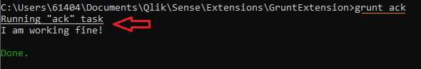
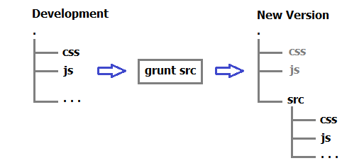

#  Grunt QSE Template Pre-defined Tasks

You newly created **QlikSense Visualization Extension** by running the **Grunt Scaffolding** (Grunt QSE Template Execution) includes a set of Grunt tasks ready to assist you managing the development of your extension and distributing it to your QlikSense Server or GitHub or QlikBranch.

## Installing Grunt Contributions

All the tasks we instruct grunt to run are based by modules know as **grunt-contrib**, when you ran the **Grunt Scaffolding** command (e.g. **grunt-init QSE**), it created a *bin* folder with the batch scripts to install the required grunt contributions.
<ol>
<li>Start a command session (**cmd.exe**).
<li>Navigate to the <i>Visualization Extension</i> folder.
<pre>cd C:\Users\&lt;user_account>\Documents\Qlik\Sense\Extensions\&lt;Extension_Name></pre>
<li>Run the batch file: <code>Install-Dependencies.bat</code><pre>bin\Install-Dependencies.bat</pre>
Now, depending in your workstation resources the process could take few long minutes to run, as it is installing all the contribution modules.

The *Grunt Contributions* installation creates the folder: **node_modules**, with the code for all the contributions and their dependencies, this is a fairly large folder.

<li>Now you can test Grunt by running this command at your command session in the &lt;Extension_Name> home folder.
<pre>grunt ack</pre>
You should get an output like this one:  

</ol>
**We are ready to use grunt task runner**.

## Grunt Contributions Tasks

If you type <code>grunt -help</code> you will get a list of all the tasks available in your installation of **Grunt**. These tasks are:  

<table style="border: 1px solid black; border-collapse: collapse; text-align: left;" width="100%">
  <tr style="background-color: #e5e8e8; font: 13px Tahoma;">
    <th>Tasks</th>
    <th>Description</th>
	<th>Comments</th>
  </tr>
  <tr style="font: 13px Arial; vertical-align: text-top;">
    <td>
        ack  
    </td><td>
		Custom task.
    </td>
	<td>
		Test task.
	</td>
  </tr>
  <tr style="font: 13px Arial; vertical-align: text-top;">
	<td>
        clean  
    </td><td>
		Clean files and folders. *
    </td>
	<td>&diams;&nbsp;src
		&diams;&nbsp;build
    </td>
  </tr>
  <tr style="font: 13px Arial; vertical-align: text-top;">
	<td>
        concat  
    </td><td>
		Concatenate files. * 
		Concatenate banners
	</td>
	<td>
		&diams;&nbsp;build		
	</td>
  </tr>
  <tr style="font: 13px Arial; vertical-align: text-top;">
	<td>
        uglify  
    </td><td>
		Minify files with UglifyJS. *
	</td>
	<td>
		&diams;&nbsp;build		
	</td>
  </tr>
  <tr style="font: 13px Arial; vertical-align: text-top;">
	<td>
        qunit  
    </td><td>
		Run QUnit unit tests in a headless Chrome instance. *
	</td>
	<td></td>
  </tr>
  <tr style="font: 13px Arial; vertical-align: text-top;">
	<td>
        jshint  
    </td><td>
		Validate files with JSHint. *
	</td>
	<td>
		&diams;&nbsp;build		
	</td>
  </tr>
  <tr style="font: 13px Arial; vertical-align: text-top;">
	<td>
        watch  
    </td><td>
		Run predefined tasks whenever watched files change.
	</td>
	<td></td>
  </tr>
  <tr style="font: 13px Arial; vertical-align: text-top;">
	<td>
        copy  
    </td><td>
		Copy files. *
	</td>
	<td>
		&diams;&nbsp;src
		&diams;&nbsp;build		
	</td>
  </tr>
  <tr style="font: 13px Arial; vertical-align: text-top;">
	<td>
        replace  
    </td><td>
		General purpose text replacement for grunt. Allows you to
                replace text in files using strings, regexs or functions. *
	</td>
	<td>
		&diams;&nbsp;src
		&diams;&nbsp;build		
	</td>
  </tr>
  <tr style="font: 13px Arial; vertical-align: text-top;">
	<td>
        cssmin  
    </td><td>
		Minify CSS *
	</td>
	<td>
		&diams;&nbsp;build		
	</td>
    </tr>
  <tr style="font: 13px Arial; vertical-align: text-top;">
	<td>
    	compress  
    </td><td>
		Compress files. *
    </td>
	<td>
		&diams;&nbsp;build		
	</td>
  </tr>
  <tr style="font: 13px Arial; vertical-align: text-top;">
	<td>
        src
	</td><td>
  		Alias for: 
		"replace:version", 
		"clean:src", 
		"copy:src" tasks.
	</td>
	<td>
		Updates: version and src folder.
	</td>
  </tr>
  <tr style="font: 13px Arial; vertical-align: text-top;">
	<td>
         build  
    </td><td>
		Alias for 
		"jshint:src", 
		"clean:build", 
		"concat:build", 
		"copy:build", 
		"cssmin:build", 
		"replace:build", 
		"uglify:build", 
		"copy:distSRC", 
		"copy:distMIX", 
		"copy:distMIN", 
		"replace:distMIN", 
		"clean:tempJS", 
		"compress:distSRC", 
		"compress:distMIX", 
		"compress:distMIN", 
		"clean:build" tasks.
	</td>
	<td>
		Creates distributions: src, mix and min.
	</td>
</tr>
</table>

## Grunt QSE Tasks

The Grunt QSE Template installs a **Gruntfile.js** on the *Visualization Extension* home directory, it define a couple of tasks to assist you managing the deployment of your visualization extension; you should be in the *extension* home directory to run these tasks:

#### src

<pre>grunt src</pre>

* It increases the **version number** of your visualization extension in these files:
	* package.json &nbsp;&nbsp;&nbsp;&nbsp; &nbsp;&nbsp;&nbsp;&nbsp; &nbsp;&nbsp;&nbsp;&nbsp;&nbsp;&nbsp;&nbsp;&nbsp;&nbsp;&#10139; **version** field.
	* &lt;Extension_Name>.qend &nbsp;&#10139; **description** and **version** fields
	* js\properties.js &nbsp;&nbsp;&nbsp;&nbsp; &nbsp; &nbsp;&nbsp;&nbsp;&nbsp;  &nbsp;&nbsp;&nbsp;&nbsp; &#10139;&nbsp; **label** attribute of **myaboutversion** property.
* It clear the **src** folder in your home directory.
* It copies these files into your **src** folder:
	* css\*.* &#10139; &lt;extension_name>\src\css
	* js\*.* &#10139; &lt;extension_name>\src\js
	* &lt;extension_name>.* &#10139; &lt;extension_name>

#### build

<pre>grunt build</pre>

* It checks your JavaScripts files code with **jshint**.
* It clean the staging folder: **work**; with **clean**.
* It includes the banner text to all the JavaScripts (js) and Cascade Style Sheets (css) files; with **concat**.
* It copy the files *&lt;extension&#95;name>.png* and *&lt;extension&#95;name>.qext* to the staging folder **work**; with **copy**.
* It minimize the Cascade Style Sheet file located in the staging folder; with **cssmin**
* It updates references to minimized JavaScript and Cascade Style Sheet files; with **replace**.
* It minimize JavaScript files; with **uglify**
* It copy distribution specific files; with **copy:distSRC**, **copy:distMIX** and **copy:distMIN**.
* It deletes the staging file: **&lt;extension&#95;name>.replace-text.js**.
* It creates the zip files for each distribution into the **dist** folder; with **compress**.
* It deletes the staging folder **work**; with **clean**.

## Grunt Tasks Workflow

Now these are the suggestion to organize your work around these Grunt Tasks that were installed with your QlikSense Visualization Extension!

<ul>
<li> You develop and debug your visualization extension as usual, by working in its **&lt;extension&#95;name>** folder and sub-folders with QlikSense 

Each time you reach an stable point in your development, you could run <code>&nbsp;&nbsp;grunt src&nbsp;&nbsp;</code> to update the src folder with your latest stable point. 

All this development cycle is happening in your extension home directory 

<li> Once you reach that moment in your development that your visualization is ready for deployment, and you are confident it is doing what was required by its specifications, then you can build its distribution, by running the command <code>&nbsp;&nbsp;grunt build&nbsp;&nbsp;</code> 
Grunt creates 3 distribution files:
<ul><li>&lt;extension_name>.zip
<li>&lt;extension_name>-min.zip
<li>&lt;extension_name>-mix.zip
</ul>

#### &lt;extension_name>.zip

#### &lt;extension_name>-min.zip

#### &lt;extension_name>-mix.zip

