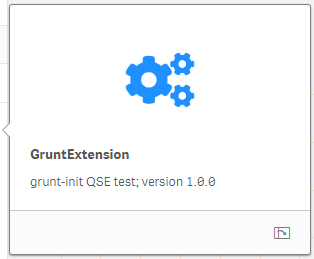
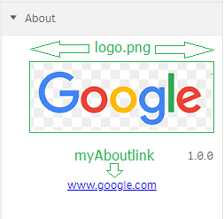

#  Grunt QS Extension Properties

  
Now that we generated our first <i>Grunt QlikSense Extension</i> let's explore its properties, we will do that by adding our new extension to an empty <i>Sheet</i> in QlikSense Desktop!

The <b>Grunt QS Extension template</b> implements all known properties organized in Sections; these properties are placeholders for you to use; you should keep the properties your extension requires and comment-out or delete those that are not required.

We will not indulge in explaining each property in this document, please refer to the [References](docs/References.md) document to access link to the relevant home pages for each piece of technology implemented.

## Properties physical file

The file **properties.js** located in the **js** folder define the *Extension* properties, feel free to amend this file to tailor the properties required by you *Extension*.

## Extension Properties Sections

The Extension features 6 properties sections:
<ol>
<li>Image Attributes
<li>Text Components
<li>Some Text Attributes
<li>Some Selectors
<li>Various
<li>About
</ol>

## Sections' Properties

These are the properties defined in each section:
<table style="border: 1px solid black; border-collapse: collapse; text-align: left;" width="100%">
<tr style="background-color: #e5e8e8; font: 13px Tahoma;">
	<th>Section</th>
	<th>Property</th>
    <th>Type</th>
	<th>Component</th>
	<th>Ref</th>
</tr>
<tr style="font: 12px Arial; vertical-align: text-top;">
<td>Image Attributes</td>
<td></td>
<td></td>
<td></td>
<td></td>
</tr>
<tr style="font: 11px Calibri; vertical-align: text-top;">
<td></td>
<td>Show Titles</td>
<td></td>
<td></td>
<td>showTitles</td>
</tr>
<tr style="font: 11px Calibri; vertical-align: text-top;">
<td></td>
<td>Image Object</td>
<td>string</td>
<td>media</td>
<td>myproperties.myImage</td>
</tr>
<tr style="font: 11px Calibri; vertical-align: text-top;">
<td></td>
<td>Image Alignment</td>
<td>string</td>
<td>align-matrix</td>
<td>myproperties.myImageAlignment</td>
<tr style="font: 11px Calibri; vertical-align: text-top;">
<td></td>
<td>Image Padding</td>
<td>boolean</td>
<td>switch</td>
<td>myproperties.myImagePadding</td>
</tr>
<tr style="font: 12px Arial; vertical-align: text-top;">
<td>Text Components</td>
<td></td>
<td></td>
<td></td>
<td></td>
</tr>
<tr style="font: 11px Calibri; vertical-align: text-top;">
<td></td>
<td><i>Label</i></td>
<td></td>
<td>text</td>
<td></td>
</tr>
<tr style="font: 11px Calibri; vertical-align: text-top;">
<td></td>
<td>Font Size (Integer)</td>
<td>integer</td>
<td></td>
<td>myproperties.myFontSize</td>
</tr>
<tr style="font: 11px Calibri; vertical-align: text-top;">
<td></td>
<td>String (Input Text)</td>
<td>string</td>
<td></td>
<td>myproperties.myInputText</td>
</tr>
<tr style="font: 11px Calibri; vertical-align: text-top;">
<td></td>
<td style="font: 11px Calibri; vertical-align: text-top;">My Button (Button ...)</td>
<td></td>
<td>component</td>
<td>myproperties.myInputText</td>
</tr>
<tr style="font: 11px Arial; vertical-align: text-top;">
<td>Some Text Attributes</td>
<td></td>
<td></td>
<td></td>
<td></td>
</tr>
<tr style="font: 11px Calibri; vertical-align: text-top;">
<td></td>
<td><i>Label</i></td>
<td></td>
<td>text</td>
<td></td>
</tr>
<tr style="font: 11px Calibri; vertical-align: text-top;">
<td></td>
<td>Font Weight (Button Group)</td>
<td>string</td>
<td>buttongroup</td>
<td>myproperties.myWeight</td>
</tr>
<tr style="font: 11px Calibri; vertical-align: text-top;">
<td></td>
<td>Show extra div? (boolean)</td>
<td>boolean</td>
<td></td>
<td>myproperties.myShow</td>
</tr>
<tr style="font: 11px Calibri; vertical-align: text-top;">
<td></td>
<td>Background (Color-picker)</td>
<td>integer</td>
<td>color-picker</td>
<td>myproperties.myColorPicker</td>
</tr>
<tr style="font: 11px Calibri; vertical-align: text-top;">
<td></td>
<td>Select Options (dropdown)</td>
<td>string</td>
<td>dropdown</td>
<td>myproperties.myDropDown</td>
</tr>
<tr style="font: 12px Arial; vertical-align: text-top;">
<td>Some Selectors</td>
<td></td>
<td></td>
<td></td>
<td></td>
</tr>
<tr style="font: 11px Calibri; vertical-align: text-top;">
<td></td>
<td><i>Label</i></td>
<td></td>
<td>text</td>
<td></td>
</tr>
<tr style="font: 11px Calibri; vertical-align: text-top;">
<td></td>
<td><i>Label (url)</i></td>
<td></td>
<td>link</td>
<td></td>
</tr>
<tr style="font: 11px Calibri; vertical-align: text-top;">
<td></td>
<td>Letter Spacing (Slider)</td>
<td>number</td>
<td>slider</td>
<td>myproperties.mySlider</td>
</tr>
<tr style="font: 11px Calibri; vertical-align: text-top;">
<td></td>
<td>Range slider</td>
<td>array</td>
<td>slider</td>
<td>myproperties.myRangeSlider</td>
</tr>
<tr style="font: 11px Calibri; vertical-align: text-top;">
<td></td>
<td>Show Border (Switch)</td>
<td>boolean</td>
<td>switch</td>
<td>myproperties.mySwitch</td>
</tr>
<tr style="font: 12px Arial; vertical-align: text-top;">
<td>Various</td>
<td></td>
<td></td>
<td></td>
<td></td>
</tr>
<tr style="font: 11px Calibri; vertical-align: text-top;">
<td></td>
<td>Textarea</td>
<td></td>
<td>textarea</td>
<td>myproperties.myTextarea</td>
</tr>
<tr style="font: 11px Calibri; vertical-align: text-top;">
<td></td>
<td><i>Label</i></td>
<td></td>
<td>text</td>
<td></td>
</tr>
<tr style="font: 11px Calibri; vertical-align: text-top;">
<td></td>
<td>List Items</td>
<td>array</td>
<td></td>
<td>myproperties.myListItems</td>
</tr>
<tr style="font: 11px Calibri; vertical-align: text-top;">
<td></td>
<td>Label</td>
<td>string</td>
<td></td>
<td>myproperties.myListLabel</td>
</tr>
<tr style="font: 11px Calibri; vertical-align: text-top;">
<td></td>
<td>My textarea</td>
<td></td>
<td>textarea</td>
<td>myproperties.myListTextarea</td>
</tr>
<tr style="font: 12px Arial; vertical-align: text-top;">
<td>About</td>
<td></td>
<td></td>
<td></td>
<td></td>
</tr>
<tr style="font: 11px Calibri; vertical-align: text-top;">
<td></td>
<td>.</td>
<td></td>
<td>link</td>
<td></td>
</tr>
<tr style="font: 11px Calibri; vertical-align: text-top;">
<td></td>
<td>1.0.0</td>
<td></td>
<td>link</td>
<td></td>
</tr>
<tr style="font: 11px Calibri; vertical-align: text-top;">
<td></td>
<td>http://google.com</td>
<td></td>
<td>link</td>
<td></td>
</tr>
</table>

## Notes

<b>Property</b>
<ul>
<li><i>Label</i> describe free-form text appearing on the property panel; this is the way to include cues to the users about a particular property.
<li>Label (no italics) is the name assigned to the property.
<li>Otherwise, it is the friendly name assigned to the property.
</ul>
<b>Type</b>
<ul>
<li>These are the variable types for each property.
<li>They could be: <i>array</i>, <i>boolean</i>, <i>integer</i>, <i>number</i>, <i>string</i> ...
<li>If a property returns an object or it displays information to the user, they do not have a <b>Type</b>; this is the case for the following components: <i>textarea</i>, <i>link</i>, <i>component</i>
<li>There are some properties showing text (<i>text labels</i>) like labels, decorating the property with messages to the users, they do not have a type.
</ul>
<b>Component</b>
<ul>
<li>There are properties having a Component attribute assigned to them.
<li>These Components are predefined behaviours, they actually handle complex properties renditions.
<li>These Components are: <i>align-matrix</i>, <i>buttongroup</i>, <i>color-picker</i>, <i>dropdown</i>, <i>link</i>, <i>media</i>, <i>switch</i>, <i>text</i>, <i>textarea</i>
</ul>
<b>Ref</b>
<ul>
<li>These are the names of the variable objects receiving the value returned by the property upon user interaction.
<li>No all properties return a value as we can gather from the table above.
</ul>

## Show Titles

<ul>
<li>This is an special boolean property.
<li>It handles the sheet's title behaviour by showing/hiding the sheet's titles.
</ul>

## About property

This property is expected to contain information related to your *Extension*, such as a logo-icon, its version number and the url of your company.

The object **myAboutSection** in the file **properties.js** define those attributes, configuring your *Extension*'s About property requires you to perform these updates:
<ol>
<li>Copy a file named logo.png to the QlikSense's *Content Default* folder if you are working with QlikSense Desktop, or upload the file to the *Content* container if you are working with QlikSense Cloud or QlikSense Enterprise.
<li>Update your company details at the **myAboutlink** object inthe **properties.js** file.
</ol>
