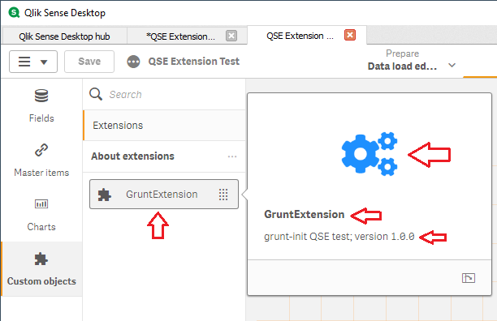

#  Grunt QSE Template execution

This section explains how to use the **Grunt QSE Template** with a simple example, let's create the simpliest *QlikSense Extension* possible, which is the *Extension* that the **Grunt's QSE scaffolding** creates by default.

## Our Environment

We could be working with:<ul>
<li>QlikSense Desktop
<li>QlikSense Cloud
<li>QlikSense Enterprise</ul>

The procedure in this document is based on the *QlikSense Desktop Environment*

## Requirements

These are the tools you may need:<ul>
<li>The **QSE Grunt Template** installed and tested.
<li>Your favourite editor, it could be:<ol>
<li> <a href="https://en.wikipedia.org/wiki/Sublime">Sublime</a>.
<li><a href="https://en.wikipedia.org/wiki/Visual_Studio_Code">Visual Studio Code</a> also known as **VSCode**.
<li>QlikSense Desktop's **Dev Hub**.</ol>
<li>Your favourite Markdown editor (<a href="http://markdownpad.com/">MarkdownPad 2</a>); if you want to write the *Extension* Readme.Md file.
<li><a href="https://en.wikipedia.org/wiki/GitHub">GitHub</a>; if you want to add your *Extension* to a repository.
</ul>

## Procedure
<ol>
<li>We are creating the **GruntExtension** on a Windows 10 workstation, and QlikSense Desktop.
<li>Open a command prompt session, and navigate to the QlikSense's extension folder:<pre>cd C:\Users\&lt;user_account>\Documents\Qlik\Sense\Extensions</pre>
<li>Create the GruntExtension folder <pre>mkdir GruntExtension:</pre>
<li>Navigate to the new folder:<pre> cd GruntExtension</pre>
<li>Type the command <pre>grunt-init QSE</pre>
This command creates our extension environment for us; it ask several questions that we should answer, these questions are:
<table style="border: 1px solid black; border-collapse: collapse; text-align: left;" width="100%">
  <tr style="background-color: #e5e8e8; font: 13px Tahoma;">
	<th>Prompt</th>
	<th>Description</th>
  </tr>
  <tr style="font: 13px Arial; vertical-align: text-top;">
	<td>Project Name</td>
	<td>This is the name of our Extension. It is also the name of the folder containing its code. Press ENTER accepting the default value. Example: <b>GruntExtension</b> 
    Mandatory</td>
  </tr>
  <tr style="font: 13px Arial; vertical-align: text-top;">
	<td>Description</td>
	<td>Write a brief text describing your extension. Example: <b>grunt-init QSE test</b></td>
  </tr>
  <tr style="font: 13px Arial; vertical-align: text-top;">
	<td>type</td>
	<td>Should always be "visualization" Example: <b>visualization</b> 
	Mandatory</td>
    </td>
  </tr>
  <tr style="font: 13px Arial; vertical-align: text-top;">
	<td>Version</td>
	<td>Defines your individual version handling of the extension. This setting is manually defined. We suggest a <i>Semantic Versioning</i> of Major.Minor.Patch. 
	Example: 1.0.0
	</td>
  </tr>
  <tr style="font: 13px Arial; vertical-align: text-top;">
	<td>icon</td>
	<td>Icon displayed in the library. 
	Default value: "extension" Check the <b>Qext file overview</b> for more information. Example: <b>extension</b>
	</td>
  </tr>
  <tr style="font: 13px Arial; vertical-align: text-top;">
	<td>Author name</td>
	<td>It defaults to your name. It is the name of the extension author. grunt-init figures your name out from the environment. Example: <b>Arnaldo Sandoval</b>
	</td>
  </tr>
  <tr style="font: 13px Arial; vertical-align: text-top;">
	<td>Project homepage</td>
	<td>This is the Extension's repository home page. It could be at GitHub, or at Qlik Branch. 
	Example: <b>https://github.com/Rock-VbCity/GruntExtension</b></td>
  </tr>
  <tr style="font: 13px Arial; vertical-align: text-top;">
	<td>keywords</td>
	<td>Optional. Defines the keywords for the mashup. Qlik documentation does not elaboate on how these keywords are referenced. Example: <b>qlik-sense, visualization</b>
	</td>
  </tr>
  <tr style="font: 13px Arial; vertical-align: text-top;">
	<td>license</td>
	<td>Optional. Defines the license that applies to the mashup. Grunt documentation includes this note: &nbsp;&nbsp;&nbsp;&nbsp;The license(s) for the project. &nbsp;&nbsp;&nbsp;&nbsp;Multiple licenses are separated by spaces. &nbsp;&nbsp;&nbsp;&nbsp;The licenses built-in are: MIT, MPL-2.0, GPL-2.0, and Apache-2.0. &nbsp;&nbsp;&nbsp;&nbsp;Defaults to MIT. Example: <b>MIT</b></td>
  </tr>
  <tr style="font: 13px Arial; vertical-align: text-top;">
	<td>Project git repository</td>
	<td>Optional. Define information about the repository. The default value may need amendments when your workstation's user account is not the same you are using at GitHub. Example: <b>git://github.com/Rock-VbCity/GruntExtension.git</b></td>
  </tr>
  <tr style="font: 13px Arial; vertical-align: text-top;">
	<td>Author email</td>
	<td>Qlik documentation does not suggest including this field. Grunt init does in order to have your GitHub properly documented. Grunt-init defaults your email address from your workstation environment. <b>Example: <b>mail_account@hotmail.com</td>
  </tr>
  <tr style="font: 13px Arial; vertical-align: text-top;">
	<td>Author url</td>
	<td>You could include your own page's url in this field. Qlik does not expect the field. Grunt does not explain this field further. Example:</td>
  </tr>
</table>
Finally, it prompts you: Do you want to make any changes to the above before continuing? (y/N) The following output appears in your command session: 
 
The GruntExtension has been created and ready to be enhanced with code, it appears as shown in the next image:
 
We can notice that some of the fields <b>grunt-init QSE</b> prompted us, already become part of the <i>GruntExtension</i>.

These are some of the fields we entered plus aditional items that become part of the new extension:<ol>
<li>The name of the extension: <i>GruntExtension</i>.
<li>Its description: <i>grunt-init QSE test</i>
<li>Its version: <i>version 1.0.0</i>
<li>Its library icon.
<li>Its icon.</ol></ol>

## After installation objects

 
The <b>grunt-init QSE</b> scaffolder applied the information we entered to create some folders and files, including the <i>GruntExtension.qext</i> file. Let's explain them:
<table style="border: 1px solid black; border-collapse: collapse; text-align: left;" width="100%">
  <tr style="background-color: #e5e8e8; font: 13px Tahoma;">
	<th>Name</th>
	<th>Type</th>
	<th>Description</th>
  </tr>
  <tr style="font: 13px Arial; vertical-align: text-top;">
	<td>bin</td>
	<td>Folder</td>
	<td><ul><li>Grunt implement its tasks with a set of contribution packages.<li>They are known as grunt-contrib.<li>The was often enhanced by their developers, so we do not check them in the GitHub respository.<li>Instead, we include batch script files to install them.<li>This folder contains those batch files:</ul>
    Install-Dependencies.bat 
    Install_Contrib_Clean.bat 
    Install_Contrib_Concat.bat 
    Install_Contrib_Copy.bat 
    Install_Contrib_jshint.bat 
    Install_Contrib_qunit.bat 
    Install_Contrib_Text_Replace.bat 
    Install_Contrib_Uglify.bat 
    Install_Contrib_watch.bat 
    Install_Grunt.bat
    </td>
  </tr>
  <tr style="font: 13px Arial; vertical-align: text-top;">
	<td>css</td>
	<td>Folder</td>
	<td><ul><li>This folder contains the Cascade Style Sheets (css) files required by this extension.<li>The file: <i>myAboutProperty.css</i> is include because the default extension deployed by <b>grunt-init QSE</b> implements it.</td>
  </tr>
  <tr style="font: 13px Arial; vertical-align: text-top;">
	<td>js</td>
	<td>Folder</td>
	<td><ul><li>This folder contains the JavaScript (js) files referenced by this extension.<li>The <i>properties.js</i> is included by default; it  implements the default properties of the <i>Extension</i> installed by <b>grunt-init QSE</b>.<li>We dedicate a section explaining the default attributes and properties of the extension installed by the <b>QSE Template</b>.</ul></td>
  </tr>
  <tr style="font: 13px Arial; vertical-align: text-top;">
	<td>GruntExtension.js</td>
	<td>js</td>
	<td><ul><li>This is the <i>javascript</i> code of your extension.<li>It also references the <i>properties.js</i> script as well as the <i>jQuery</i> module.<li>We dedicate a section explaining the default attributes and properties of the extension installed by the <b>QSE Template</b>.</ul>
    </td>
  </tr>
  <tr style="font: 13px Arial; vertical-align: text-top;">
	<td>GruntExtension.png</td>
	<td>png</td>
	<td><ul><li>This is the <i>Preview</i> image installed by <b>grunt-init QSE</b>.<li>Any <i>Extension</i> you create with <b>grunt-init</b> features this image. 
        </ul>
    </td>
  </tr>
  <tr style="font: 13px Arial; vertical-align: text-top;">
	<td>GruntExtension.qext</td>
	<td>Qext</td>
	<td><ul><li>The Qlik Sense extension file, or qext file.<li>It is in fact a JSON file and is used by Qlik Sense to identify the visualization.<li>It contains meta data used for the Library or Assets panel.<li>When deployed to Qlik Sense, the visualization is displayed in the Charts section of the Assets panel or Library panel.<li>All visualizations must contain at least one qext file and one JavaScript file.<li>The data in this file was collected from the answers you provided when running <b>grunt-init QSE <i>Extension_Name</i></b></ul></td>
  </tr>
  <tr style="font: 13px Arial; vertical-align: text-top;">
	<td>Gruntfile.js</td>
	<td>js</td>
	<td><ul><li>This is the file defining the custom tasks available to your <i>Extension</i> as part of running <b>grunt-init QSE</b>.<li>They are not part of the <i>QlikSense Extension</i>.<li><b>Grunt</b> is a JavaScript task runner, a tool used to automatically perform frequent tasks such as minification, compilation, unit testing, and linting.<li>You can use <b>Grunt</b> to manage your <i>QlikSense Extension</i> in GitHub.
    </ul>
    </td>
  </tr>
  <tr style="font: 13px Arial; vertical-align: text-top;">
	<td>logo.png</td>
	<td>png</td>
	<td><ul><li>This is part of the default extension installed by <b>grunt-init</b><li>It is the Google's logo. </ul>
	</td>
  </tr>
  <tr style="font: 13px Arial; vertical-align: text-top;">
	<td>package.json</td>
	<td>json</td>
	<td><ul><li>This is a metadata files created when we ran the <b>grunt-init QSE</b> command.<li>It holds the dependencies of your Grunt project.<li>Actually, this folder contains your QlikSense Extension code as well as the Grunt project.<li>The Grunt project handles everything related to your QlikSense Extension GitHub repository managament.
	</ul>
    </td>
  </tr>
  <tr style="font: 13px Arial; vertical-align: text-top;">
	<td>wbfolder.wbl</td>
	<td>wbl</td>
	<td><ul><li>It is simply a list of files in the extension, with one line for every file, terminated by semicolon.<li>It is only used by the dev-hub editors. Without it you cannot open or duplicate the extension in <b>dev-hub</b>.<li>If you do have it, only the files listed in wbfolder.wbl will be available in the <b>dev-hub</b> editors.<li>Also only the files in wbfolder.wbl will be copied if you make a copy of the extension or mashup (using <b>dev-hub</b>).</ul></td>
  </tr>
</table>

## The extension in the Dev-Hub

The new <i>extension</i>, "<b>GruntExtension</b>" is available for maintenance at the Qlik Dev Hub is you generated it in the folder: <pre>C:\Users\&lt;user_account>\Documents\Qlik\Sense\Extensions</pre>
You can identify it by its name and icon. 
The extension editor open once you click on its icon!  
 
  
Once we open the <i>GruntExtension</i> in the Dev-Hub we get access to all its files, we can then review the code and add new functionalities. 
We explains at length the extension features at: [Grunt Extension Features](docs/Grunt-Extension-Features.md)  
 