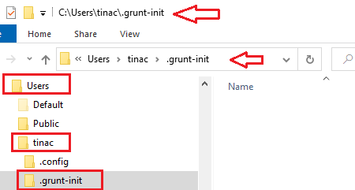
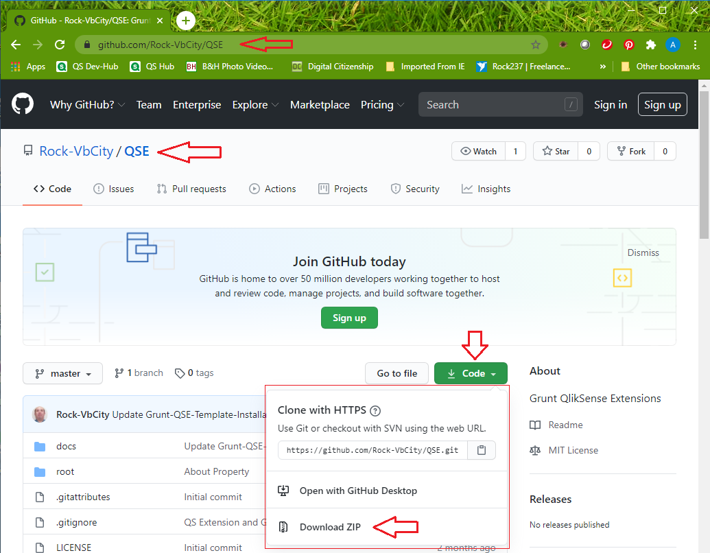
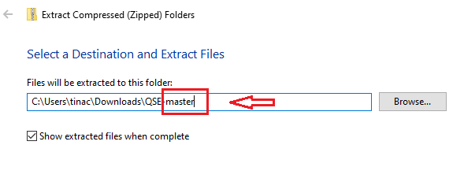
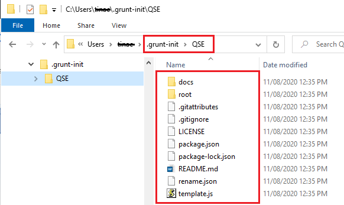

#  QSE Grunt Template installation

This section explains the installation of the **QSE Grunt Template**, which is the main component in this repository. You should had read the [Grunt Prerequisites](docs/Grunt-Prerequisites.md) section, and followed the installation instructions described by the section [Grunt Installation](docs/Grunt-Installation.md).

You should have an empty .grunt-init folder at your C:\Users\<user_account>\.grunt-init, as shown below:

Before installing the **QSE** Template repository you should decide the folder that best suits your needs or preferences, these are some of the possibilities:

* [Install directly into the .grunt-init folder](#install-directly-into-the-grunt-init-folder).
* [Install into your GitHub repositories parent folder](#install-into-your-github-repositories-parent-folder).
* [Install into your QlikSense Desktop folder](#Install-into-your-QlikSense-Desktop-folder).

You need to install the **QSE** Template repository at one of these three folders. 

##### Install directly into the grunt init folder
This procedure assume that your do not have GitHub installed in your Windows environment, so we show the steps to <b>clone</b> the repository directly into the <b>.grunt-init</b> folder we just created. 
<ol>
	<li>Open a DOS command session.
	<li>Navigate to the .grunt-init folder
<pre>cd \users\&lt;user_account>\.grunt-init
</pre>
    <li>If you have GitHub installed in your Windows environment, then you can execute its close command as shown:
<pre>
git clone https://github.com/Rock-VbCity/QSE QSE
</pre>
    Otherwise you need to open the GitHub repository and download the QSE repository as follow:
<li> Open your browser
<li> Enter the below's URL into the browser's <i>address bar</i>
<pre>https://github.com/Rock-VbCity/QSE
</pre>
<li> <i>Click</i> on the Download <b>Code</b> button (see image below)
<li> <i>Click</i> on the <b>Download ZIP</b> option:

<li> Open the folder with the <b>QSE-master.zip</b> file, and unzip the file, removing the <b>-master</b> tag

<li> <i>Click</i> on the <b>Extract</b> button.
<li> Navigate into the QSE folder (the sub-folder name is <b>QSE-master</b>
<li> Rename this folder to <b>QSE</b>
<li> <i>Right Click</i> on the folder <i>QSE</i> and select the <b>Cut</b> option.
<li> <i>Navigate</i> to the folder:
<pre>\users\&lt;user_account>\.grunt-init
</pre>
<li> <i>Right-Click</i> and select the option <b>Paste</b>
<li> <i>Navigate</i> to the <b>Downloads</b> folder and delete the <i>QSE-master.zip</i> and <i>QSE</i> folders.
<li> The folder <b>.grunt-init</b> should looks like this:

<li> <b>Procedure Complete</b>; now you should resume in the section: 
</ol>
[Testing your Grunt QSE Template](#testing-your-grunt-qse-template).

##### Install into your GitHub repositories parent folder

We are assuming that you have GitHub installed in your Windows environment, and that you want to <b>Clone</b> the <i>Grunt QSE Template</i> into your GitHub's home directory:

<ol>
	<li>Open a DOS command session.
	<li>Navigate to the .grunt-init folder
<pre>cd \users\&lt;user_account>\GitHub
</pre>
    <li>If you have Git installed in your Windows environment, then you can execute its close command as shown:
<pre>
git clone https://github.com/Rock-VbCity/QSE QSE
</pre>

<li> <b>Procedure Complete</b>; but Grunt is not ready to find the <i>QSE template</i> as yet, because we are missing a couple of steps, explained in the section</ol>

[Linking the .init-folde\QSE with your QSE installation folder](#linking-the-.init-folde\QSE-with-your-QSE-installation-folder).

##### Install into your QlikSense Desktop folder

Finally, if you do not want to <b>Clone</b> the <i>QSE Template</i> repository on either of the folders used above, and you want to keep this repository closer to the Qlik Sense parent directory, like: <i>Local Disk (C:)</i> > <i>Users</i> > <i>&lt;user_account></i> > <i>Documents</i> > <i>Qlik</i>.

We are also assuming you installed Git in your Windows environment.

These are the steps to follow:  

### Linking the .init-folde\QSE with your QSE installation folder

### Testing your Grunt QSE Template

