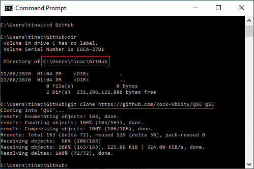
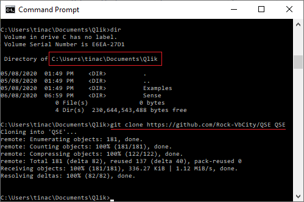
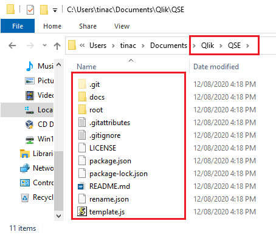
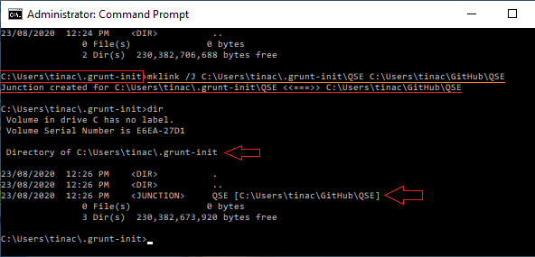
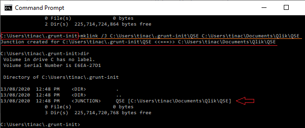
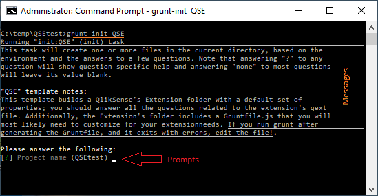

#  QSE Grunt Template installation

This section explains the installation of the **QSE Grunt Template**, which is the main component in this repository. You should had read the [Grunt Prerequisites](docs/Grunt-Prerequisites.md) section, and followed the installation instructions described by the section [Grunt Installation](docs/Grunt-Installation.md).

You should have an empty <b>.grunt-init</b> folder at your <b>C:\Users\&lt;user_account>\\.grunt-init</b>, as shown below: 

Before installing the **QSE** Template repository you should decide the folder that best suits your needs or preferences, these are some of the possibilities:

* [Install directly into the .grunt-init folder](#install-directly-into-the-grunt-init-folder).
* [Install into your GitHub repositories parent folder](#install-into-your-github-repositories-parent-folder).
* [Install into your QlikSense Desktop folder](#Install-into-your-QlikSense-Desktop-folder).

You need to install the **QSE** Template repository at one of these three folders. 

##### Install directly into the grunt init folder
This procedure assume that your do not have GitHub installed in your Windows environment, so we show the steps to <b>clone</b> the repository directly into the <b>.grunt-init</b> folder we just created. 
<ol>
	<li>Open a DOS command session.
	<li>Navigate to the <b>.grunt-init</b> folder
<pre>cd \users\&lt;user_account>\.grunt-init
</pre>
    <li>If you have GitHub installed in your Windows environment, then you can execute its close command as shown:
<pre>
git clone https://github.com/Rock-VbCity/QSE QSE
</pre>
    Otherwise you need to open the GitHub repository and download the QSE repository as follow:
<li> Open your browser
<li> Enter the below's URL into the browser's <i>address bar</i>
<pre>https://github.com/Rock-VbCity/QSE
</pre>
<li> <i>Click</i> on the Download <b>Code</b> button (see image below)
<li> <i>Click</i> on the <b>Download ZIP</b> option: 

<li> Open the folder with the <b>QSE-master.zip</b> file, and unzip the file, removing the <b>-master</b> tag

<li> <i>Click</i> on the <b>Extract</b> button.
<li> Navigate into the QSE folder (the sub-folder name is <b>QSE-master</b>
<li> Rename this folder to <b>QSE</b>
<li> <i>Right Click</i> on the folder <i>QSE</i> and select the <b>Cut</b> option.
<li> <i>Navigate</i> to the folder:
<pre>\users\&lt;user_account>\.grunt-init
</pre>
<li> <i>Right-Click</i> and select the option <b>Paste</b>
<li> <i>Navigate</i> to the <b>Downloads</b> folder and delete the <i>QSE-master.zip</i> and <i>QSE</i> folders.
<li> The folder <b>.grunt-init</b> should looks like this: 

<li> <b>Procedure Complete</b>; now you should resume in the section: 
</ol>
[Testing your Grunt QSE Template](#testing-your-grunt-qse-template).

##### Install into your GitHub repositories parent folder

We are assuming that you have GitHub installed in your Windows environment, and that you want to <b>Clone</b> the <i>Grunt QSE Template</i> into your GitHub's home directory:

<ol>
	<li>Open a DOS command session.
	<li>Navigate to the .grunt-init folder
<pre>cd \users\&lt;user_account>\GitHub
</pre>
    <li>If you have <b>Git</b> installed in your Windows environment, then you can execute its <b>clone</b> command as shown:
<pre>
git clone https://github.com/Rock-VbCity/QSE QSE
</pre>

<li> <b>Procedure Complete</b>; but Grunt is not ready to find the <i>QSE template</i> as yet, because we are missing a couple of steps, explained in the section</ol>

[Linking the .init-folde\QSE with your QSE installation folder](#linking-the-.init-folde\QSE-with-your-QSE-installation-folder).

##### Install into your QlikSense Desktop folder

Finally, if you do not want to <b>Clone</b> the <i>QSE Template</i> repository on either of the folders used above, and you want to keep this repository closer to the Qlik Sense parent directory, like:<pre> <i>Local Disk (C:)</i> > <i>Users</i> > <i>&lt;user_account></i> > <i>Documents</i> > <i>Qlik</i></pre>

and, assuming you had installed Git in your Windows environment, then these are the steps to follow:  

<ol>
	<li>Open a DOS command session.
	<li>Navigate to the <b>Documents\Qlik</b> folder
<pre>cd \users\&lt;user_account>\Documents\Qlik
</pre>
    <li>If you have <b>Git</b> installed in your Windows environment, then you can execute its <b>clone</b> command as shown:
<pre>
git clone https://github.com/Rock-VbCity/QSE QSE
</pre>
 
<b>Procedure Complete</b>; but Grunt is not ready to find the <i>QSE template</i> as yet, because we are missing a couple of steps, explained in the section: 

Linking the .init-folder\QSE with your QSE installation folder.  

<li> If you do not have <b>git</b> installed, you should continue the procedure by opening your browser.
<li> Enter the below's URL into the browser's <i>address bar</i>
<pre>https://github.com/Rock-VbCity/QSE
</pre>
<li> <i>Click</i> on the Download <b>Code</b> button (see image below)
<li> <i>Click</i> on the <b>Download ZIP</b> option:

<li> Open the folder with the <b>QSE-master.zip</b> file, and unzip the file, removing the <b>-master</b> tag

<li> <i>Click</i> on the <b>Extract</b> button.
<li> Navigate into the QSE folder (the sub-folder name is <b>QSE-master</b>
<li> Rename this folder to <b>QSE</b>
<li> <i>Right Click</i> on the folder <i>QSE</i> and select the <b>Cut</b> option.
<li> <i>Navigate</i> to the folder:
<pre>\users\&lt;user_account>\Documents\Qlik
</pre>
<li> <i>Right-Click</i> and select the option <b>Paste</b>
<li> <i>Navigate</i> to the <b>Downloads</b> folder and delete the <i>QSE-master.zip</i> and <i>QSE</i> folders.
<li> The folder <b>\users\&lt;user_account>\Documents\Qlik</b> should looks like this:

<li> <b>Procedure Complete</b>; now you should resume in the section: 
</ol>
[Linking the .init-folde\QSE with your QSE installation folder](#linking-the-.init-folder\QSE-with-your-QSE-installation-folder).

### Linking the .init-folder\QSE with your QSE installation folder

If you installed the <b>Grunt QSE template</b> at the <i>GitHub</i>'s or <i>Qlik</i>'s parent directories, you should create a link for the command <pre>grunt-init QSE</pre> to work, because <i>grunt-init</i> looks for the template at the folder:<pre>C:\Users\&lt;user_account>\\.grunt-init</pre>
You should follow these steps to link the <b>QSE</b> Template folder:
<ol>
<li> Open a DOS command session.
<li> Navigate to the <b>.grunt-init</b> folder:<pre> cd \Users\&lt;user_account>\.grunt-init</pre>
<li> Now depending on the folder you installed the <b>QSE</b> Template repository, type the following command:
<ul>
<li> <b>GitHub repositories parent folder:</b> <code>\users\&lt;user_account>\GitHub</code>
Type the command: <pre>mklink /J C:\Users\&lt;user_account>\.grunt-init\QSE C:\Users\&lt;user_account>\GitHub\QSE</pre>

</ul></ol>
[Testing your Grunt QSE Template](#testing-your-grunt-qse-template).
<ul><ul> 
<li> <b>QlikSense Desktop folder:</b> <code>\users\&lt;user_account>\Documents\Qlik</code> 
Type the command: <pre>mklink /J C:\Users\&lt;user_account>\.grunt-init\QSE C:\Users\&lt;user_account>\Documents\Qlik\QSE</pre>

</ul> 
</ul>
</ul></ol>
[Testing your Grunt QSE Template](#testing-your-grunt-qse-template).

### Testing your Grunt QSE Template
It is time to test the Grunt QSE Template, please follow these steps:
<ol>
<li> Open a DOS command session.
<li> Navigate to the <b>C:\Temp</b> folder:<pre> cd C:\Temp</pre>
<li> Let's create a sub-folder with the name <b>QSEtest</b><pre>mkdir QSEtest</pre>
<li> Navigate to the new folder:<pre>cd QSEtest></pre>
<li> Now type the command <b>grunt-init</b> with the parameter <i>QSE</i> as shown<pre>grunt-init QSE</pre>
The grunt-init start to execute the <b>QSE</b> template by displaying some messages, and asking several questions. We are not going to explain these questions here, as we are just making sure we properly installed the <b>QSE Template</b>

Now type Ctrl + C to brake the execution of the grunt-init execution.
</ol>
### Conclusions
We just installed the <b>QSE Template</b> in your working environment; we illustrated its installation at three different folders, you only has to install it at one of them; the reason to extend this installation was for you to select the one that better suit your working style.

Now, return to the main [README.md](README.md) document to continue your familiarization with this template.